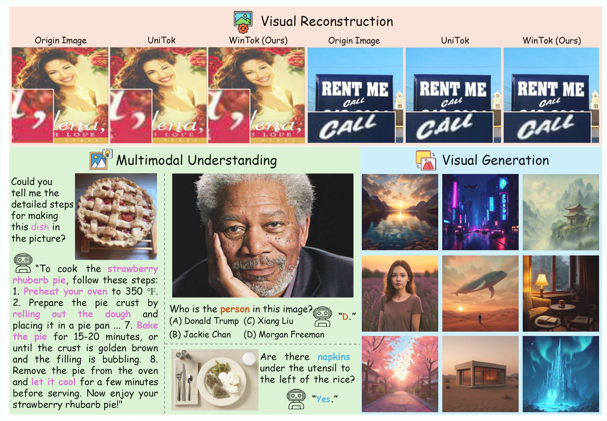

<div align="center">
<h1>WinTok: A Win-Win Hybrid Tokenizer via Decomposing Visual Understanding and Generation with Transferable Tokens</h1>

[](https://arxiv.org/abs/2605.18115)
[](https://github.com/markywg/WinTok)
[](https://huggingface.co/markyw/WinTok/tree/main)
</div>

This project introduces **WinTok**, a concise hybrid visual tokenizer designed to resolve the long-standing conflict between visual understanding and generation. By decoupling semantic and pixel tokens with an asymmetric distillation mechanism, WinTok achieves a win-win across reconstruction, understanding, and generation, surpassing strong baselines with substantially less training data. <br><br>

> <a href="https://arxiv.org/abs/2605.18115">WinTok: A Win-Win Hybrid Tokenizer via Decomposing Visual Understanding and Generation with Transferable Tokens</a><br>
> [Yiwei Guo](https://scholar.google.com/citations?user=HCAyeJIAAAAJ&hl=zh-CN&oi=ao), [Shaobin Zhuang](https://scholar.google.com/citations?user=PGaDirMAAAAJ&hl=zh-CN&oi=ao), Canmiao Fu, [Zhipeng Huang](https://scholar.google.com/citations?user=_fnuIHUAAAAJ&hl=zh-CN&oi=ao), [Chen Li](https://scholar.google.com/citations?hl=zh-CN&user=WDJL3gYAAAAJ), Jing LYU, [Yali Wang](https://scholar.google.com/citations?hl=zh-CN&user=hD948dkAAAAJ)<br>
> Shenzhen Institutes of Advanced Technology (Chinese Academy of Sciences), WeChat Vision (Tencent Inc.), Shanghai Jiao Tong University<br>
> ```
> @article{guo2026wintok,
>   title={WinTok: A Win-Win Hybrid Tokenizer via Decomposing Visual Understanding and Generation with Transferable Tokens},
>   author={Guo, Yiwei and Zhuang, Shaobin and Huang, Zhipeng and Fu, Canmiao and Li, Chen and LYU, Jing and Wang, Yali},
>   journal={arXiv preprint arXiv:2605.18115},
>   year={2026}
> }
> ```

<p align="center">
  
  <br>
  <em>WinTok achieves superior performance on downstream applications, surpassing previous unified tokenizers, with a more flexible hybrid encoding mechanism.</em>
</p>

## 📰 News
* **[2026.05.19]** 🚀 🚀 🚀 We are excited to release **WinTok**, a unified visual tokenizer featuring our novel **hybrid encoding** and **asymmetric distillation**. Code and model are now available!

## 📖 Implementations

### 🛠️ Installation
- **Dependencies**: 
```
bash env.sh
```

### Evaluation

- **Evaluation on ImageNet 50K Validation Set**

The dataset should be organized as follows:
```
imagenet
└── val/
    ├── ...
```

Run the 256×256 resolution evaluation script, change the corresponding path:
```
bash scripts/eval_tokenizer/eval_metrics_ddp.sh
```

- **Evaluation on MS-COCO Val2017**

The dataset should be organized as follows:
```
MSCOCO2017
└── val2017/
    ├── ...
```

Run the 256×256 resolution evaluation script, change the corresponding path:
```
bash scripts/eval_tokenizer/eval_metrics_ddp.sh
```


### Inference

Simply test the effect of model reconstruction:
```
python recon.py --ckpt_path path_to_ckpt
```